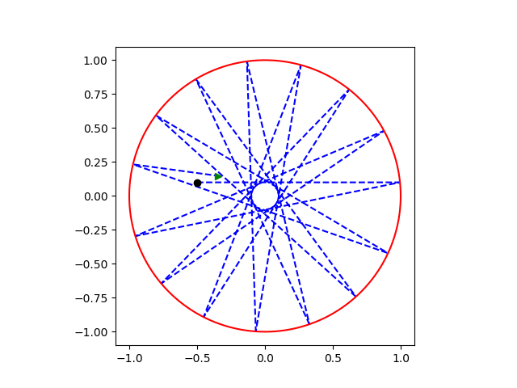

# Billiards

Write a program simulating "billiards on a circle". More precisely: inside the unit circle, a particle (point) moves on the plane, maintaining a constant speed, until it hits the edge i.e. the circle, then it reflects according to the principle that the angle of incidence equals the angle of reflection; it is about the angle between the velocity vector and the radius of the unit circle at the point where the path intersects with the circle, after reflection it is the same in value but on the other side of the radius. The program should draw the unit circle and the path of the particle inside this circle, depending on from the initial position, the direction of the initial velocity (the velocity value is irrelevant as it is constant), and the observation time.

The program produces graphs similar to the following:

the black dot indicates the initial position, and the green dot — the final position.